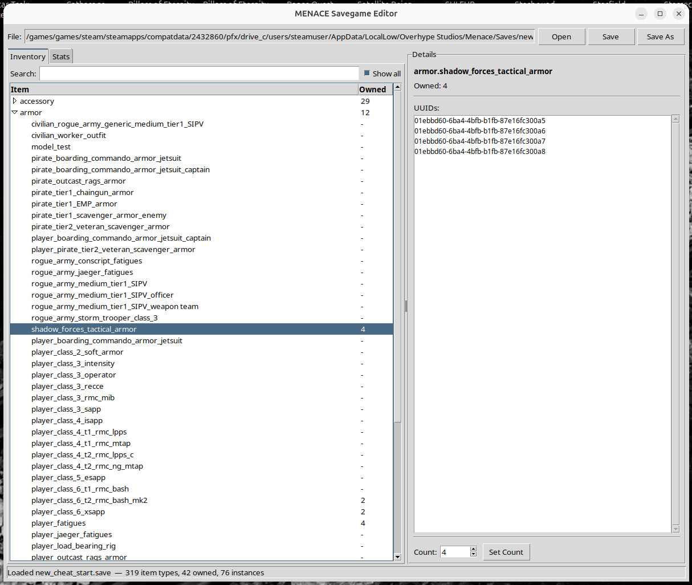
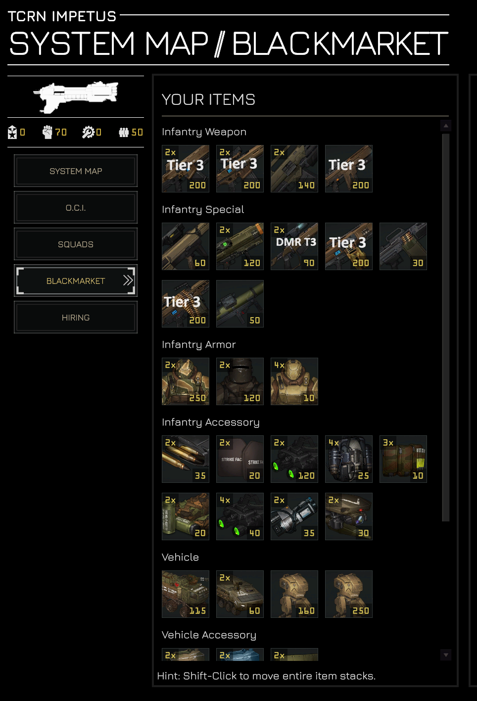

# MENACE Savegame Editor

A save editor for the game [MENACE](https://store.steampowered.com/app/2432860/MENACE/).



## Features

- **Inventory editing** — add, remove, or set item counts for any item in the catalog
- **Global stats editing** — modify OCI Components, Promotion Points, Intelligence, Authority, and other stats
- **GUI** (tkinter) — browse items by category, search/filter, and edit counts visually
- **CLI** — list, search, clone items, and verify save integrity from the terminal
- **Auto-backup** — creates a `.save.bak` before overwriting

## Requirements

- Python 3.10+
- tkinter (included with most Python installations)

## Usage

### GUI

```
python3 menace_gui.py
```

Open a `.save` file, browse/edit items and stats, then save.



### CLI

```
python3 menace_save.py list <savefile>            # show all owned items
python3 menace_save.py search <savefile> <query>  # search items by name
python3 menace_save.py clone <savefile> <query> [count] [output]  # clone items
python3 menace_save.py verify <savefile>          # verify round-trip integrity
```

## Save File Location

MENACE save files are typically found at:
- **Linux:** `~/.local/share/MENACE/`
- **Proton Linux** `~/.steam/steamapps/compatdata/2432860/pfx/drive_c/users/steamuser/AppData/LocalLow/Overhype Studios/Menace/Saves/`
- **Windows:** `%APPDATA%\LocalLow\Overhype Studios\Menace\Saves\`

## License

GPLv3
